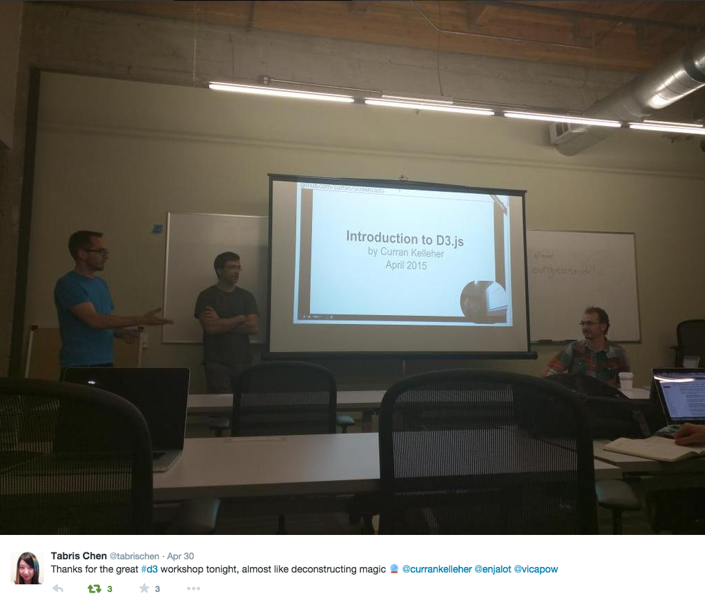

# Introduction to D3

 * [YouTube Video Presentation](https://www.youtube.com/watch?v=8jvoTV54nXw)
 * [Slides and Code Examples](http://curran.github.io/screencasts/introToD3/examples/viewer/#/) (use left and right arrow keys to navigate [examples](http://curran.github.io/screencasts/introToD3/examples/viewer/#/1))
   * [Slides only](http://www.slideshare.net/currankelleher/introduction-to-d3-55556705)

This tutorial covers fundamental [D3.js](http://d3js.org/) concepts from the ground up, and introduces basic visualizations.

 * Technologies leveraged by D3: HTML, SVG, CSS, JavaScript
 * SVG graphical elements: rect, circle, line, path
 * Fundamental D3 concepts: CSV data, selections, scales, axes
 * Visualizations: bar chart, scatter plot, line chart

More advanced tutorials that build off this one:

 * [Splitting Charts](https://www.youtube.com/watch?v=6Xynj_pBybc) (Stacked & Grouped bar charts)
 * [Introduction to Chiasm](https://www.youtube.com/watch?v=MpweS7gNBt4) (encapsulating reusable D3 patterns and charts)

## Navigating the Video

The video is very long. Here's an index of checkpoints where the focus shifts. You can click these times to go to specific points in the YouTube video.

 * [0:00 - 7:08](https://youtu.be/8jvoTV54nXw) Background information
 * [7:08 - 25:20](https://youtu.be/8jvoTV54nXw?t=7m8s) Code examples covering basic HTML, SVG, and CSS
 * [25:20 - 32:54](https://youtu.be/8jvoTV54nXw?t=25m20s) JavaScript overview, including parsing strings
 * [32:54 - 45:57](https://youtu.be/8jvoTV54nXw?t=32m54s) Basic D3 (parsing CSV data, simple DOM manipulation, scales)
 * [45:57 - 1:02:00](https://youtu.be/8jvoTV54nXw?t=45m57s) D3 selections and the Enter, Update, Exit pipeline
 * [1:02:00 - 1:13:45](https://youtu.be/8jvoTV54nXw?t=1h2m) Building up a colored bubble chart with the Iris data set
 * [1:13:45 - 1:22:30](https://youtu.be/8jvoTV54nXw?t=1h13m45s) Visualizing Population vs. GDP using log and sqrt scales
 * [1:22:30 - 1:25:05](https://youtu.be/8jvoTV54nXw?t=1h22m30s) Visualizing cities (see also [World City Explorer](http://bl.ocks.org/curran/752b97cef3f880a813ab))
 * [1:25:05 - 1:27:58](https://youtu.be/8jvoTV54nXw?t=1h25m5s) Building a line chart of temperature
 * [1:27:58 - 1:32:10](https://youtu.be/8jvoTV54nXw?t=1h27m58s) Building a bar chart of city populations
 * [1:32:10 - end](https://youtu.be/8jvoTV54nXw?t=1h32m10s) Adding axes and text labels to visualizations

The [video for this tutorial](http://www.galvanize.com/) was recorded at a free event held in San Francisco on April 30, 2015. Many thanks to [@enjalot](https://twitter.com/enjalot) and the [Bay Area D3 Meetup Group](http://www.meetup.com/Bay-Area-d3-User-Group/) for helping organize the event. Also big thanks to [Galvanize](http://www.galvanize.com/) for donating the great space for the evening.

Correction from screencast: Mike Bostock is no longer at the New York Times, see this twitterstorm https://twitter.com/mbostock/status/595252571658260481

The music interludes in the video come from my [soundcloud posts](https://soundcloud.com/curran).

## List of Examples

Check out the [Example Viewer](http://curran.github.io/screencasts/introToD3/examples/viewer/#/1). Use left and right arrow keys to navigate.

 * [Example 1](http://curran.github.io/screencasts/introToD3/examples/viewer/#/1) - ([run it!](http://curran.github.io/screencasts/introToD3/examples/code/snapshot01) | [index.html](http://curran.github.io/screencasts/introToD3/examples/viewer/#/1/index.html)) - Hello HTML
 * [Example 2](http://curran.github.io/screencasts/introToD3/examples/viewer/#/2) - ([run it!](http://curran.github.io/screencasts/introToD3/examples/code/snapshot02) | [index.html](http://curran.github.io/screencasts/introToD3/examples/viewer/#/2/index.html)) - Hello SVG
 * [Example 3](http://curran.github.io/screencasts/introToD3/examples/viewer/#/3) - ([run it!](http://curran.github.io/screencasts/introToD3/examples/code/snapshot03) | [index.html](http://curran.github.io/screencasts/introToD3/examples/viewer/#/3/index.html)) - Default SVG size
 * [Example 4](http://curran.github.io/screencasts/introToD3/examples/viewer/#/4) - ([run it!](http://curran.github.io/screencasts/introToD3/examples/code/snapshot04) | [index.html](http://curran.github.io/screencasts/introToD3/examples/viewer/#/4/index.html)) - Specifying SVG dimensions
 * [Example 5](http://curran.github.io/screencasts/introToD3/examples/viewer/#/5) - ([run it!](http://curran.github.io/screencasts/introToD3/examples/code/snapshot05) | [index.html](http://curran.github.io/screencasts/introToD3/examples/viewer/#/5/index.html)) - Adding (x, y) coordinates
 * [Example 6](http://curran.github.io/screencasts/introToD3/examples/viewer/#/6) - ([run it!](http://curran.github.io/screencasts/introToD3/examples/code/snapshot06) | [index.html](http://curran.github.io/screencasts/introToD3/examples/viewer/#/6/index.html)) - Adding color
 * [Example 7](http://curran.github.io/screencasts/introToD3/examples/viewer/#/7) - ([run it!](http://curran.github.io/screencasts/introToD3/examples/code/snapshot07) | [index.html](http://curran.github.io/screencasts/introToD3/examples/viewer/#/7/index.html)) - rgb() color syntax
 * [Example 8](http://curran.github.io/screencasts/introToD3/examples/viewer/#/8) - ([run it!](http://curran.github.io/screencasts/introToD3/examples/code/snapshot08) | [index.html](http://curran.github.io/screencasts/introToD3/examples/viewer/#/8/index.html)) - Transparency with rgba()
 * [Example 9](http://curran.github.io/screencasts/introToD3/examples/viewer/#/9) - ([run it!](http://curran.github.io/screencasts/introToD3/examples/code/snapshot09) | [index.html](http://curran.github.io/screencasts/introToD3/examples/viewer/#/9/index.html)) - Hex color codes
 * [Example 10](http://curran.github.io/screencasts/introToD3/examples/viewer/#/10) - ([run it!](http://curran.github.io/screencasts/introToD3/examples/code/snapshot10) | [index.html](http://curran.github.io/screencasts/introToD3/examples/viewer/#/10/index.html)) - Drawing outlines with stroke
 * [Example 11](http://curran.github.io/screencasts/introToD3/examples/viewer/#/11) - ([run it!](http://curran.github.io/screencasts/introToD3/examples/code/snapshot11) | [index.html](http://curran.github.io/screencasts/introToD3/examples/viewer/#/11/index.html)) - Controlling stroke width
 * [Example 12](http://curran.github.io/screencasts/introToD3/examples/viewer/#/12) - ([run it!](http://curran.github.io/screencasts/introToD3/examples/code/snapshot12) | [index.html](http://curran.github.io/screencasts/introToD3/examples/viewer/#/12/index.html)) - Using fill=none
 * [Example 13](http://curran.github.io/screencasts/introToD3/examples/viewer/#/13) - ([run it!](http://curran.github.io/screencasts/introToD3/examples/code/snapshot13) | [index.html](http://curran.github.io/screencasts/introToD3/examples/viewer/#/13/index.html)) - Drawing a circle
 * [Example 14](http://curran.github.io/screencasts/introToD3/examples/viewer/#/14) - ([run it!](http://curran.github.io/screencasts/introToD3/examples/code/snapshot14) | [index.html](http://curran.github.io/screencasts/introToD3/examples/viewer/#/14/index.html)) - cx and cy
 * [Example 15](http://curran.github.io/screencasts/introToD3/examples/viewer/#/15) - ([run it!](http://curran.github.io/screencasts/introToD3/examples/code/snapshot15) | [index.html](http://curran.github.io/screencasts/introToD3/examples/viewer/#/15/index.html)) - stroke and width
 * [Example 16](http://curran.github.io/screencasts/introToD3/examples/viewer/#/16) - ([run it!](http://curran.github.io/screencasts/introToD3/examples/code/snapshot16) | [index.html](http://curran.github.io/screencasts/introToD3/examples/viewer/#/16/index.html)) - drawing a line
 * [Example 17](http://curran.github.io/screencasts/introToD3/examples/viewer/#/17) - ([run it!](http://curran.github.io/screencasts/introToD3/examples/code/snapshot17) | [index.html](http://curran.github.io/screencasts/introToD3/examples/viewer/#/17/index.html)) - drawing several lines
 * [Example 18](http://curran.github.io/screencasts/introToD3/examples/viewer/#/18) - ([run it!](http://curran.github.io/screencasts/introToD3/examples/code/snapshot18) | [index.html](http://curran.github.io/screencasts/introToD3/examples/viewer/#/18/index.html)) - using SVG paths
 * [Example 19](http://curran.github.io/screencasts/introToD3/examples/viewer/#/19) - ([run it!](http://curran.github.io/screencasts/introToD3/examples/code/snapshot19) | [index.html](http://curran.github.io/screencasts/introToD3/examples/viewer/#/19/index.html)) - drawing several lines with a path
 * [Example 20](http://curran.github.io/screencasts/introToD3/examples/viewer/#/20) - ([run it!](http://curran.github.io/screencasts/introToD3/examples/code/snapshot20) | [index.html](http://curran.github.io/screencasts/introToD3/examples/viewer/#/20/index.html)) - filling a path
 * [Example 21](http://curran.github.io/screencasts/introToD3/examples/viewer/#/21) - ([run it!](http://curran.github.io/screencasts/introToD3/examples/code/snapshot21) | [index.html](http://curran.github.io/screencasts/introToD3/examples/viewer/#/21/index.html)) - closing a path
 * [Example 22](http://curran.github.io/screencasts/introToD3/examples/viewer/#/22) - ([run it!](http://curran.github.io/screencasts/introToD3/examples/code/snapshot22) | [index.html](http://curran.github.io/screencasts/introToD3/examples/viewer/#/22/index.html)) - pseudo scatterplot
 * [Example 23](http://curran.github.io/screencasts/introToD3/examples/viewer/#/23) - ([run it!](http://curran.github.io/screencasts/introToD3/examples/code/snapshot23) | [index.html](http://curran.github.io/screencasts/introToD3/examples/viewer/#/23/index.html)) - the g element
 * [Example 24](http://curran.github.io/screencasts/introToD3/examples/viewer/#/24) - ([run it!](http://curran.github.io/screencasts/introToD3/examples/code/snapshot24) | [index.html](http://curran.github.io/screencasts/introToD3/examples/viewer/#/24/index.html)) - pseudo bar chart
 * [Example 25](http://curran.github.io/screencasts/introToD3/examples/viewer/#/25) - ([run it!](http://curran.github.io/screencasts/introToD3/examples/code/snapshot25) | [index.html](http://curran.github.io/screencasts/introToD3/examples/viewer/#/25/index.html)) - pseudo line chart
 * [Example 26](http://curran.github.io/screencasts/introToD3/examples/viewer/#/26) - ([run it!](http://curran.github.io/screencasts/introToD3/examples/code/snapshot26) | [index.html](http://curran.github.io/screencasts/introToD3/examples/viewer/#/26/index.html)) - SVG Text
 * [Example 27](http://curran.github.io/screencasts/introToD3/examples/viewer/#/27) - ([run it!](http://curran.github.io/screencasts/introToD3/examples/code/snapshot27) | [index.html](http://curran.github.io/screencasts/introToD3/examples/viewer/#/27/index.html)) - Styling SVG Text with CSS
 * [Example 28](http://curran.github.io/screencasts/introToD3/examples/viewer/#/28) - ([run it!](http://curran.github.io/screencasts/introToD3/examples/code/snapshot28) | [index.html](http://curran.github.io/screencasts/introToD3/examples/viewer/#/28/index.html)) - CSS class selector syntax
 * [Example 29](http://curran.github.io/screencasts/introToD3/examples/viewer/#/29) - ([run it!](http://curran.github.io/screencasts/introToD3/examples/code/snapshot29) | [index.html](http://curran.github.io/screencasts/introToD3/examples/viewer/#/29/index.html)) - multiple SVG text elements
 * [Example 30](http://curran.github.io/screencasts/introToD3/examples/viewer/#/30) - ([run it!](http://curran.github.io/screencasts/introToD3/examples/code/snapshot30) | [index.html](http://curran.github.io/screencasts/introToD3/examples/viewer/#/30/index.html)) - font fill and stroke
 * [Example 31](http://curran.github.io/screencasts/introToD3/examples/viewer/#/31) - ([run it!](http://curran.github.io/screencasts/introToD3/examples/code/snapshot31) | [index.html](http://curran.github.io/screencasts/introToD3/examples/viewer/#/31/index.html)) - Using Google Fonts
 * [Example 32](http://curran.github.io/screencasts/introToD3/examples/viewer/#/32) - ([run it!](http://curran.github.io/screencasts/introToD3/examples/code/snapshot32) | [index.html](http://curran.github.io/screencasts/introToD3/examples/viewer/#/32/index.html)) - Applying CSS to circles
 * [Example 33](http://curran.github.io/screencasts/introToD3/examples/viewer/#/33) - ([run it!](http://curran.github.io/screencasts/introToD3/examples/code/snapshot33) | [index.html](http://curran.github.io/screencasts/introToD3/examples/viewer/#/33/index.html)) - JavaScript Debugging
 * [Example 34](http://curran.github.io/screencasts/introToD3/examples/viewer/#/34) - ([run it!](http://curran.github.io/screencasts/introToD3/examples/code/snapshot34) | [index.html](http://curran.github.io/screencasts/introToD3/examples/viewer/#/34/index.html)) - JavaScript Numbers
 * [Example 35](http://curran.github.io/screencasts/introToD3/examples/viewer/#/35) - ([run it!](http://curran.github.io/screencasts/introToD3/examples/code/snapshot35) | [index.html](http://curran.github.io/screencasts/introToD3/examples/viewer/#/35/index.html)) - JavaScript Strings
 * [Example 36](http://curran.github.io/screencasts/introToD3/examples/viewer/#/36) - ([run it!](http://curran.github.io/screencasts/introToD3/examples/code/snapshot36) | [index.html](http://curran.github.io/screencasts/introToD3/examples/viewer/#/36/index.html)) - Concatenation
 * [Example 37](http://curran.github.io/screencasts/introToD3/examples/viewer/#/37) - ([run it!](http://curran.github.io/screencasts/introToD3/examples/code/snapshot37) | [index.html](http://curran.github.io/screencasts/introToD3/examples/viewer/#/37/index.html)) - Concatenation of number strings
 * [Example 38](http://curran.github.io/screencasts/introToD3/examples/viewer/#/38) - ([run it!](http://curran.github.io/screencasts/introToD3/examples/code/snapshot38) | [index.html](http://curran.github.io/screencasts/introToD3/examples/viewer/#/38/index.html)) - Parsing strings with parseFloat
 * [Example 39](http://curran.github.io/screencasts/introToD3/examples/viewer/#/39) - ([run it!](http://curran.github.io/screencasts/introToD3/examples/code/snapshot39) | [index.html](http://curran.github.io/screencasts/introToD3/examples/viewer/#/39/index.html)) - Parsing strings with +
 * [Example 40](http://curran.github.io/screencasts/introToD3/examples/viewer/#/40) - ([run it!](http://curran.github.io/screencasts/introToD3/examples/code/snapshot40) | [index.html](http://curran.github.io/screencasts/introToD3/examples/viewer/#/40/index.html)) - JavaScript Arrays
 * [Example 41](http://curran.github.io/screencasts/introToD3/examples/viewer/#/41) - ([run it!](http://curran.github.io/screencasts/introToD3/examples/code/snapshot41) | [index.html](http://curran.github.io/screencasts/introToD3/examples/viewer/#/41/index.html)) - JavaScript Objects
 * [Example 42](http://curran.github.io/screencasts/introToD3/examples/viewer/#/42) - ([run it!](http://curran.github.io/screencasts/introToD3/examples/code/snapshot42) | [index.html](http://curran.github.io/screencasts/introToD3/examples/viewer/#/42/index.html)) - An array of objects
 * [Example 43](http://curran.github.io/screencasts/introToD3/examples/viewer/#/43) - ([run it!](http://curran.github.io/screencasts/introToD3/examples/code/snapshot43) | [index.html](http://curran.github.io/screencasts/introToD3/examples/viewer/#/43/index.html)) - JavaScript functions
 * [Example 44](http://curran.github.io/screencasts/introToD3/examples/viewer/#/44) - ([run it!](http://curran.github.io/screencasts/introToD3/examples/code/snapshot44) | [index.html](http://curran.github.io/screencasts/introToD3/examples/viewer/#/44/index.html)) - Functions in variables
 * [Example 45](http://curran.github.io/screencasts/introToD3/examples/viewer/#/45) - ([run it!](http://curran.github.io/screencasts/introToD3/examples/code/snapshot45) | [index.html](http://curran.github.io/screencasts/introToD3/examples/viewer/#/45/index.html)) - Functional forEach
 * [Example 46](http://curran.github.io/screencasts/introToD3/examples/viewer/#/46) - ([run it!](http://curran.github.io/screencasts/introToD3/examples/code/snapshot46) | [index.html](http://curran.github.io/screencasts/introToD3/examples/viewer/#/46/index.html)) - Loading CSV data
 * [Example 47](http://curran.github.io/screencasts/introToD3/examples/viewer/#/47) - ([run it!](http://curran.github.io/screencasts/introToD3/examples/code/snapshot47) | [index.html](http://curran.github.io/screencasts/introToD3/examples/viewer/#/47/index.html)) - Concatenating unparsed strings
 * [Example 48](http://curran.github.io/screencasts/introToD3/examples/viewer/#/48) - ([run it!](http://curran.github.io/screencasts/introToD3/examples/code/snapshot48) | [index.html](http://curran.github.io/screencasts/introToD3/examples/viewer/#/48/index.html)) - Parsing CSV data
 * [Example 49](http://curran.github.io/screencasts/introToD3/examples/viewer/#/49) - ([run it!](http://curran.github.io/screencasts/introToD3/examples/code/snapshot49) | [index.html](http://curran.github.io/screencasts/introToD3/examples/viewer/#/49/index.html)) - Parsing CSV data
 * [Example 50](http://curran.github.io/screencasts/introToD3/examples/viewer/#/50) - ([run it!](http://curran.github.io/screencasts/introToD3/examples/code/snapshot50) | [index.html](http://curran.github.io/screencasts/introToD3/examples/viewer/#/50/index.html)) - D3 linear scale
 * [Example 51](http://curran.github.io/screencasts/introToD3/examples/viewer/#/51) - ([run it!](http://curran.github.io/screencasts/introToD3/examples/code/snapshot51) | [index.html](http://curran.github.io/screencasts/introToD3/examples/viewer/#/51/index.html)) - D3 method chaining
 * [Example 52](http://curran.github.io/screencasts/introToD3/examples/viewer/#/52) - ([run it!](http://curran.github.io/screencasts/introToD3/examples/code/snapshot52) | [index.html](http://curran.github.io/screencasts/introToD3/examples/viewer/#/52/index.html)) - D3 getter setter functions
 * [Example 53](http://curran.github.io/screencasts/introToD3/examples/viewer/#/53) - ([run it!](http://curran.github.io/screencasts/introToD3/examples/code/snapshot53) | [index.html](http://curran.github.io/screencasts/introToD3/examples/viewer/#/53/index.html)) - D3 ordinal scale
 * [Example 54](http://curran.github.io/screencasts/introToD3/examples/viewer/#/54) - ([run it!](http://curran.github.io/screencasts/introToD3/examples/code/snapshot54) | [index.html](http://curran.github.io/screencasts/introToD3/examples/viewer/#/54/index.html)) - rangePoints
 * [Example 55](http://curran.github.io/screencasts/introToD3/examples/viewer/#/55) - ([run it!](http://curran.github.io/screencasts/introToD3/examples/code/snapshot55) | [index.html](http://curran.github.io/screencasts/introToD3/examples/viewer/#/55/index.html)) - rangeRoundPoints
 * [Example 56](http://curran.github.io/screencasts/introToD3/examples/viewer/#/56) - ([run it!](http://curran.github.io/screencasts/introToD3/examples/code/snapshot56) | [index.html](http://curran.github.io/screencasts/introToD3/examples/viewer/#/56/index.html)) - constructing DOM elements with D3
 * [Example 57](http://curran.github.io/screencasts/introToD3/examples/viewer/#/57) - ([run it!](http://curran.github.io/screencasts/introToD3/examples/code/snapshot57) | [index.html](http://curran.github.io/screencasts/introToD3/examples/viewer/#/57/index.html)) - D3 method chaining
 * [Example 58](http://curran.github.io/screencasts/introToD3/examples/viewer/#/58) - ([run it!](http://curran.github.io/screencasts/introToD3/examples/code/snapshot58) | [index.html](http://curran.github.io/screencasts/introToD3/examples/viewer/#/58/index.html)) - The complete D3 pipeline
 * [Example 59](http://curran.github.io/screencasts/introToD3/examples/viewer/#/59) - ([run it!](http://curran.github.io/screencasts/introToD3/examples/code/snapshot59) | [index.html](http://curran.github.io/screencasts/introToD3/examples/viewer/#/59/index.html)) - Passing the scale as a function
 * [Example 60](http://curran.github.io/screencasts/introToD3/examples/viewer/#/60) - ([run it!](http://curran.github.io/screencasts/introToD3/examples/code/snapshot60) | [index.html](http://curran.github.io/screencasts/introToD3/examples/viewer/#/60/index.html)) - Splitting data binding and enter
 * [Example 61](http://curran.github.io/screencasts/introToD3/examples/viewer/#/61) - ([run it!](http://curran.github.io/screencasts/introToD3/examples/code/snapshot61) | [index.html](http://curran.github.io/screencasts/introToD3/examples/viewer/#/61/index.html)) - Enter handles added data only
 * [Example 62](http://curran.github.io/screencasts/introToD3/examples/viewer/#/62) - ([run it!](http://curran.github.io/screencasts/introToD3/examples/code/snapshot62) | [index.html](http://curran.github.io/screencasts/introToD3/examples/viewer/#/62/index.html)) - Enter does not update data
 * [Example 63](http://curran.github.io/screencasts/introToD3/examples/viewer/#/63) - ([run it!](http://curran.github.io/screencasts/introToD3/examples/code/snapshot63) | [index.html](http://curran.github.io/screencasts/introToD3/examples/viewer/#/63/index.html)) - The D3 update phase
 * [Example 64](http://curran.github.io/screencasts/introToD3/examples/viewer/#/64) - ([run it!](http://curran.github.io/screencasts/introToD3/examples/code/snapshot64) | [index.html](http://curran.github.io/screencasts/introToD3/examples/viewer/#/64/index.html)) - Using enter for static properties
 * [Example 65](http://curran.github.io/screencasts/introToD3/examples/viewer/#/65) - ([run it!](http://curran.github.io/screencasts/introToD3/examples/code/snapshot65) | [index.html](http://curran.github.io/screencasts/introToD3/examples/viewer/#/65/index.html)) - The need for exit
 * [Example 66](http://curran.github.io/screencasts/introToD3/examples/viewer/#/66) - ([run it!](http://curran.github.io/screencasts/introToD3/examples/code/snapshot66) | [index.html](http://curran.github.io/screencasts/introToD3/examples/viewer/#/66/index.html)) - Exit
 * [Example 67](http://curran.github.io/screencasts/introToD3/examples/viewer/#/67) - ([run it!](http://curran.github.io/screencasts/introToD3/examples/code/snapshot67) | [index.html](http://curran.github.io/screencasts/introToD3/examples/viewer/#/67/index.html)) - Using setTimeout
 * [Example 68](http://curran.github.io/screencasts/introToD3/examples/viewer/#/68) - ([run it!](http://curran.github.io/screencasts/introToD3/examples/code/snapshot68) | [index.html](http://curran.github.io/screencasts/introToD3/examples/viewer/#/68/index.html)) - Rendering an array of objects
 * [Example 69](http://curran.github.io/screencasts/introToD3/examples/viewer/#/69) - ([run it!](http://curran.github.io/screencasts/introToD3/examples/code/snapshot69) | [index.html](http://curran.github.io/screencasts/introToD3/examples/viewer/#/69/index.html)) - Rendering a parsed CSV file
 * [Example 70](http://curran.github.io/screencasts/introToD3/examples/viewer/#/70) - ([run it!](http://curran.github.io/screencasts/introToD3/examples/code/snapshot70) | [index.html](http://curran.github.io/screencasts/introToD3/examples/viewer/#/70/index.html)) - Functional simplification
 * [Example 71](http://curran.github.io/screencasts/introToD3/examples/viewer/#/71) - ([run it!](http://curran.github.io/screencasts/introToD3/examples/code/snapshot71) | [index.html](http://curran.github.io/screencasts/introToD3/examples/viewer/#/71/index.html)) - Introducing the Iris data set
 * [Example 72](http://curran.github.io/screencasts/introToD3/examples/viewer/#/72) - ([run it!](http://curran.github.io/screencasts/introToD3/examples/code/snapshot72) | [index.html](http://curran.github.io/screencasts/introToD3/examples/viewer/#/72/index.html)) - using extent
 * [Example 73](http://curran.github.io/screencasts/introToD3/examples/viewer/#/73) - ([run it!](http://curran.github.io/screencasts/introToD3/examples/code/snapshot73) | [index.html](http://curran.github.io/screencasts/introToD3/examples/viewer/#/73/index.html)) - basic scatter plot
 * [Example 74](http://curran.github.io/screencasts/introToD3/examples/viewer/#/74) - ([run it!](http://curran.github.io/screencasts/introToD3/examples/code/snapshot74) | [index.html](http://curran.github.io/screencasts/introToD3/examples/viewer/#/74/index.html)) - inverting the Y range
 * [Example 75](http://curran.github.io/screencasts/introToD3/examples/viewer/#/75) - ([run it!](http://curran.github.io/screencasts/introToD3/examples/code/snapshot75) | [index.html](http://curran.github.io/screencasts/introToD3/examples/viewer/#/75/index.html)) - isolating configurable variables
 * [Example 76](http://curran.github.io/screencasts/introToD3/examples/viewer/#/76) - ([run it!](http://curran.github.io/screencasts/introToD3/examples/code/snapshot76) | [index.html](http://curran.github.io/screencasts/introToD3/examples/viewer/#/76/index.html)) - using variables for X and Y columns
 * [Example 77](http://curran.github.io/screencasts/introToD3/examples/viewer/#/77) - ([run it!](http://curran.github.io/screencasts/introToD3/examples/code/snapshot77) | [index.html](http://curran.github.io/screencasts/introToD3/examples/viewer/#/77/index.html)) - Adding a radius column
 * [Example 78](http://curran.github.io/screencasts/introToD3/examples/viewer/#/78) - ([run it!](http://curran.github.io/screencasts/introToD3/examples/code/snapshot78) | [index.html](http://curran.github.io/screencasts/introToD3/examples/viewer/#/78/index.html)) - Using CSS to color circles
 * [Example 79](http://curran.github.io/screencasts/introToD3/examples/viewer/#/79) - ([run it!](http://curran.github.io/screencasts/introToD3/examples/code/snapshot79) | [index.html](http://curran.github.io/screencasts/introToD3/examples/viewer/#/79/index.html)) - Drawing transparent rings
 * [Example 80](http://curran.github.io/screencasts/introToD3/examples/viewer/#/80) - ([run it!](http://curran.github.io/screencasts/introToD3/examples/code/snapshot80) | [index.html](http://curran.github.io/screencasts/introToD3/examples/viewer/#/80/index.html)) - Adding a color column
 * [Example 81](http://curran.github.io/screencasts/introToD3/examples/viewer/#/81) - ([run it!](http://curran.github.io/screencasts/introToD3/examples/code/snapshot81) | [index.html](http://curran.github.io/screencasts/introToD3/examples/viewer/#/81/index.html)) - Using fill, tweaking parameters
 * [Example 82](http://curran.github.io/screencasts/introToD3/examples/viewer/#/82) - ([run it!](http://curran.github.io/screencasts/introToD3/examples/code/snapshot82) | [index.html](http://curran.github.io/screencasts/introToD3/examples/viewer/#/82/index.html)) - Population vs. GDP
 * [Example 83](http://curran.github.io/screencasts/introToD3/examples/viewer/#/83) - ([run it!](http://curran.github.io/screencasts/introToD3/examples/code/snapshot83) | [index.html](http://curran.github.io/screencasts/introToD3/examples/viewer/#/83/index.html)) - logarithmic scales
 * [Example 84](http://curran.github.io/screencasts/introToD3/examples/viewer/#/84) - ([run it!](http://curran.github.io/screencasts/introToD3/examples/code/snapshot84) | [index.html](http://curran.github.io/screencasts/introToD3/examples/viewer/#/84/index.html)) - population as linear size
 * [Example 85](http://curran.github.io/screencasts/introToD3/examples/viewer/#/85) - ([run it!](http://curran.github.io/screencasts/introToD3/examples/code/snapshot85) | [index.html](http://curran.github.io/screencasts/introToD3/examples/viewer/#/85/index.html)) - population as logarithmic size
 * [Example 86](http://curran.github.io/screencasts/introToD3/examples/viewer/#/86) - ([run it!](http://curran.github.io/screencasts/introToD3/examples/code/snapshot86) | [index.html](http://curran.github.io/screencasts/introToD3/examples/viewer/#/86/index.html)) - population as sqrt size
 * [Example 87](http://curran.github.io/screencasts/introToD3/examples/viewer/#/87) - ([run it!](http://curran.github.io/screencasts/introToD3/examples/code/snapshot87) | [index.html](http://curran.github.io/screencasts/introToD3/examples/viewer/#/87/index.html)) - population true to size
 * [Example 88](http://curran.github.io/screencasts/introToD3/examples/viewer/#/88) - ([run it!](http://curran.github.io/screencasts/introToD3/examples/code/snapshot88) | [index.html](http://curran.github.io/screencasts/introToD3/examples/viewer/#/88/index.html)) - sizing the inner visualization
 * [Example 89](http://curran.github.io/screencasts/introToD3/examples/viewer/#/89) - ([run it!](http://curran.github.io/screencasts/introToD3/examples/code/snapshot89) | [index.html](http://curran.github.io/screencasts/introToD3/examples/viewer/#/89/index.html)) - translating the inner visualization
 * [Example 90](http://curran.github.io/screencasts/introToD3/examples/viewer/#/90) - ([run it!](http://curran.github.io/screencasts/introToD3/examples/code/snapshot90) | [index.html](http://curran.github.io/screencasts/introToD3/examples/viewer/#/90/index.html)) - sizing taking translation into account
 * [Example 91](http://curran.github.io/screencasts/introToD3/examples/viewer/#/91) - ([run it!](http://curran.github.io/screencasts/introToD3/examples/code/snapshot91) | [index.html](http://curran.github.io/screencasts/introToD3/examples/viewer/#/91/index.html)) - using variables to define the margin
 * [Example 92](http://curran.github.io/screencasts/introToD3/examples/viewer/#/92) - ([run it!](http://curran.github.io/screencasts/introToD3/examples/code/snapshot92) | [index.html](http://curran.github.io/screencasts/introToD3/examples/viewer/#/92/index.html)) - using a margin object
 * [Example 93](http://curran.github.io/screencasts/introToD3/examples/viewer/#/93) - ([run it!](http://curran.github.io/screencasts/introToD3/examples/code/snapshot93) | [index.html](http://curran.github.io/screencasts/introToD3/examples/viewer/#/93/index.html)) - specifying number of people per pixel
 * [Example 94](http://curran.github.io/screencasts/introToD3/examples/viewer/#/94) - ([run it!](http://curran.github.io/screencasts/introToD3/examples/code/snapshot94) | [index.html](http://curran.github.io/screencasts/introToD3/examples/viewer/#/94/index.html)) - visualizing cities
 * [Example 95](http://curran.github.io/screencasts/introToD3/examples/viewer/#/95) - ([run it!](http://curran.github.io/screencasts/introToD3/examples/code/snapshot95) | [index.html](http://curran.github.io/screencasts/introToD3/examples/viewer/#/95/index.html)) - tweaking the visualization
 * [Example 96](http://curran.github.io/screencasts/introToD3/examples/viewer/#/96) - ([run it!](http://curran.github.io/screencasts/introToD3/examples/code/snapshot96) | [index.html](http://curran.github.io/screencasts/introToD3/examples/viewer/#/96/index.html)) - showing density with transparency
 * [Example 97](http://curran.github.io/screencasts/introToD3/examples/viewer/#/97) - ([run it!](http://curran.github.io/screencasts/introToD3/examples/code/snapshot97) | [index.html](http://curran.github.io/screencasts/introToD3/examples/viewer/#/97/index.html)) - temperature in San Francisco
 * [Example 98](http://curran.github.io/screencasts/introToD3/examples/viewer/#/98) - ([run it!](http://curran.github.io/screencasts/introToD3/examples/code/snapshot98) | [index.html](http://curran.github.io/screencasts/introToD3/examples/viewer/#/98/index.html)) - using d3.svg.line
 * [Example 99](http://curran.github.io/screencasts/introToD3/examples/viewer/#/99) - ([run it!](http://curran.github.io/screencasts/introToD3/examples/code/snapshot99) | [index.html](http://curran.github.io/screencasts/introToD3/examples/viewer/#/99/index.html)) - drawing a proper line
 * [Example 100](http://curran.github.io/screencasts/introToD3/examples/viewer/#/100) - ([run it!](http://curran.github.io/screencasts/introToD3/examples/code/snapshot100) | [index.html](http://curran.github.io/screencasts/introToD3/examples/viewer/#/100/index.html)) - basic bar chart
 * [Example 101](http://curran.github.io/screencasts/introToD3/examples/viewer/#/101) - ([run it!](http://curran.github.io/screencasts/introToD3/examples/code/snapshot101) | [index.html](http://curran.github.io/screencasts/introToD3/examples/viewer/#/101/index.html)) - bar padding
 * [Example 102](http://curran.github.io/screencasts/introToD3/examples/viewer/#/102) - ([run it!](http://curran.github.io/screencasts/introToD3/examples/code/snapshot102) | [index.html](http://curran.github.io/screencasts/introToD3/examples/viewer/#/102/index.html)) - adding axes
 * [Example 103](http://curran.github.io/screencasts/introToD3/examples/viewer/#/103) - ([run it!](http://curran.github.io/screencasts/introToD3/examples/code/snapshot103) | [index.html](http://curran.github.io/screencasts/introToD3/examples/viewer/#/103/index.html)) - customizing axes
 * [Example 104](http://curran.github.io/screencasts/introToD3/examples/viewer/#/104) - ([run it!](http://curran.github.io/screencasts/introToD3/examples/code/snapshot104) | [index.html](http://curran.github.io/screencasts/introToD3/examples/viewer/#/104/index.html)) - horizontal bars
 * [Example 105](http://curran.github.io/screencasts/introToD3/examples/viewer/#/105) - ([run it!](http://curran.github.io/screencasts/introToD3/examples/code/snapshot105) | [index.html](http://curran.github.io/screencasts/introToD3/examples/viewer/#/105/index.html)) - axis labels
 * [Example 106](http://curran.github.io/screencasts/introToD3/examples/viewer/#/106) - ([run it!](http://curran.github.io/screencasts/introToD3/examples/code/snapshot106) | [index.html](http://curran.github.io/screencasts/introToD3/examples/viewer/#/106/index.html)) - axes on a scatter plot
 * [Example 107](http://curran.github.io/screencasts/introToD3/examples/viewer/#/107) - ([run it!](http://curran.github.io/screencasts/introToD3/examples/code/snapshot107) | [index.html](http://curran.github.io/screencasts/introToD3/examples/viewer/#/107/index.html)) - axes on a line chart

Feel free to use and modify this presentation framework for your own presentations! MIT License.

Also, feel free to present these code examples to your own audiences.

By [Curran Kelleher](https://github.com/curran/portfolio) April 2015
