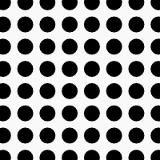
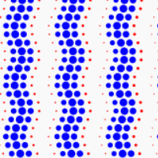
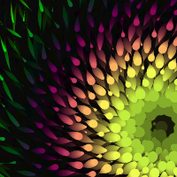
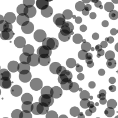

The code from an ["Mathematical Patterns" tutorial](http://www.youtube.com/watch?v=P8SaZtTctKQ&feature=youtu.be) given at MIT on July 28, 2013. Part of the [MIT HSSP 2013 Program](https://esp.mit.edu/learn/HSSP/index.html) course [Computer Programming and Interactive Graphics](http://curransoft.com/interactivegraphics/?p=485).

Here's the code from the tutorial:

 * Starter Code ([in JSBin](http://jsbin.com/edifap/4/edit), [in GitHub](starter)) you can start here to follow along.
 * Grid of Circles ([in JSBin](http://jsbin.com/edifap/30/edit), [in GitHub](gridOfCircles)) you can start here to follow along.
 * Changing Colors with Waves ([in JSBin](http://jsbin.com/edifap/54/edit), [in GitHub](changingColors))

Here's a more elaborate example demonstrating where you can take these concepts:

 * 
([run full screen](http://jsbin.com/urecex/36), [edit in JSBin](http://jsbin.com/urecex/31/edit), [in GitHub](circularPatterns))

Content of the tutorial:

 * Nested for loops
 * The m by n matrix concept
 * Declaring many variables in one statement
 * Strategies for writing code: first write the overall structure, then fill in details
 * Drawing a grid of circles
   * Computing (x, y) from (i, j)
   * Drawing circles with the HTML5 Canvas API
 * requestAnimationFrame
   * Why requestAnimationFrame is better than setInterval
 * Alternative syntax for function definition
   * `var draw = function(){}` vs. `function draw(){}`
 * Introducing a `time` variable
 * Defining animated parametric (x, y) patterns based on (u, v)
 * Assigning size as a function of (u, v, time)
 * Using JSBin to publish your programs in comments
 * Using stroke to draw outlines
 * Setting the color to be a function of size

Check out the work done by students based on the tutorial:

 *  DNA-like thing by YouTube user BK1Music ([run full screen](http://curran.github.io/screencasts/mathPatterns/studentWork/bk1music/index.html), [edit in JSFiddle](http://jsfiddle.net/B1KMusic/3wt3U/), [in GitHub](studentWork/bk1music))
